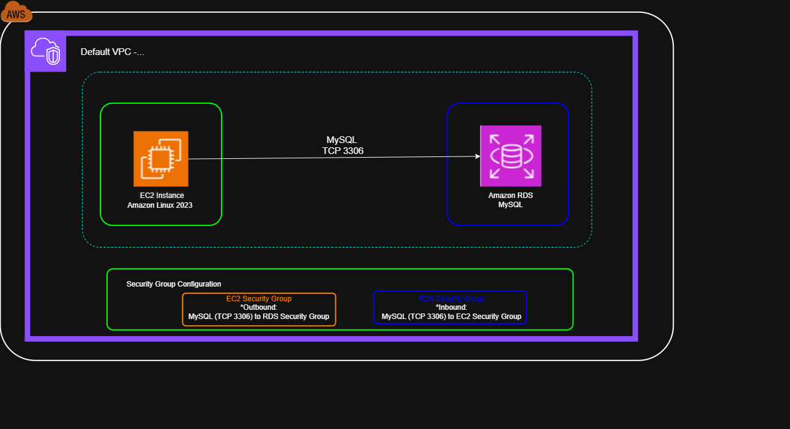

# aws-rds-mysql-database-deployment
AWS RDS MySQL database deployment with EC2 connectivity and Security Groups.

# AWS RDS Database Deployment

## Overview

This project demonstrates the deployment and configuration of an Amazon RDS MySQL database with connectivity from an EC2 instance.

The implementation focuses on database provisioning, network connectivity, Security Group configuration, and validation of the database connection using MySQL tools.

---

## Objectives

- Deploy an Amazon RDS MySQL database.
- Configure database connectivity from an EC2 instance.
- Configure Security Groups to control access to the database.
- Configure the MySQL database to use TCP port 3306.
- Validate connectivity between the EC2 instance and the RDS database.

---

## AWS Services

- **Amazon EC2** — Compute environment used to validate database connectivity.
- **Amazon RDS** — Managed relational database service.
- **MySQL** — Database engine.
- **Amazon VPC / Security Groups** — Network access control.

---

## Architecture

The architecture consists of an EC2 instance connecting to an Amazon RDS MySQL database through a controlled network path.

### Main Components

| Component | Purpose |
|---|---|
| EC2 | Client environment used to test database connectivity |
| Amazon RDS | Managed MySQL database |
| Security Group | Controls inbound access to the RDS database |
| MySQL | Database engine |
| TCP 3306 | MySQL database communication port |

---

## Implementation

The project includes the following configuration stages:

1. Create and configure the Amazon RDS MySQL database.
2. Configure the database instance and storage.
3. Configure connectivity and networking.
4. Configure the RDS Security Group.
5. Obtain the RDS endpoint.
6. Connect from the EC2 environment using MySQL tools.
7. Validate successful database connectivity.

Detailed implementation steps are documented in:

[Deployment Guide](documentation/deployment.md)

---

## Validation

The database deployment was validated by establishing a connection from the EC2 environment to the Amazon RDS MySQL endpoint.

The connection was tested using the MySQL client/tool and TCP port 3306.

Detailed validation procedures and evidence are available in:

[Testing and Validation](https://github.com/Alberto-Gomez-97/aws-rds-mysql-database-deployment/blob/main/documentation/testing.md)

---

## Security Considerations

The RDS database access was controlled through a dedicated Security Group.

Database access was restricted to the required network source and MySQL port.

> Credentials and sensitive information are not included in this repository.

---

## Key Learnings

- Deployment of managed relational databases using Amazon RDS.
- Configuration of MySQL database connectivity.
- Network access control using AWS Security Groups.
- Understanding RDS endpoints and database ports.
- Validation of connectivity between EC2 and RDS.
- Basic troubleshooting of database network connectivity.

---

## Project Status

**Completed**

The project successfully demonstrates the deployment of an Amazon RDS MySQL database and connectivity validation from an EC2 environment.
