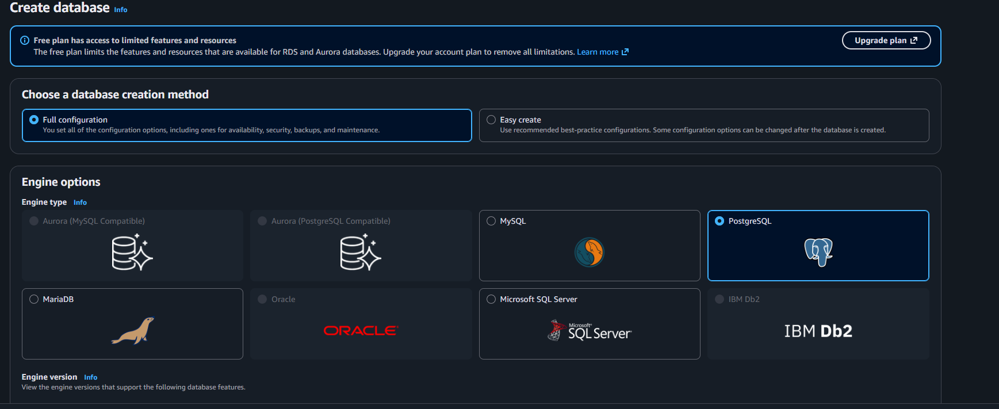

# Testing and Validation

## Overview

This document describes the validation performed after deploying the Amazon RDS MySQL database.

The tests verify database availability, network configuration, endpoint information, and connectivity from the EC2 environment.

---

## 1. RDS MySQL Configuration

### Objective

Verify that the RDS database was configured using the MySQL database engine.

### Validation

The Amazon RDS database creation workflow was reviewed to confirm the selected database engine and configuration.

### Evidence



---

## 2. Security Group Configuration

### Objective

Verify that the Security Group was configured to allow the required database traffic.

### Validation

The Security Group configuration was reviewed to verify the network rule associated with the MySQL database connection.

The required MySQL port is:

```text
3306/TCP
```
Evidence

Add screenshot here.

---
## 3. Database Endpoint and Port
Objective

Verify the RDS endpoint and database port required for client connectivity.

Validation

The RDS endpoint was identified after the database became available.

The MySQL connection uses TCP port:
3306

Evidence
Add screenshot here.

---

## 4. EC2 to RDS Connectivity
Objective

Validate connectivity between the EC2 instance and the Amazon RDS MySQL database.

Validation

The connection was initiated from the EC2 environment using the RDS endpoint and MySQL port 3306.

Example:
mysql -h <RDS_ENDPOINT> -P 3306 -u admin -p'<DB_PASSWORD>'
Credentials are not included in this repository.

Evidence

Add screenshot here.

---

## 5. MySQL Connection Test
Objective

Confirm that the EC2 environment successfully established a connection to the RDS MySQL database.

Validation

The database connection was tested using the MySQL client/tool.

A successful connection confirms that:

The RDS database is available.
The RDS endpoint is correct.
Port 3306 is accessible.
The Security Group permits the required traffic.
The database credentials are valid.
Evidence

Add screenshot here.

---

## Test Summary
Test	                        Result
RDS Database Availability	    Passed
Security Group Configuration	Passed
RDS Endpoint and Port	        Passed
EC2 to RDS Connectivity	      Passed
MySQL Connection Test	        Passed

---

## Conclusion

The Amazon RDS MySQL deployment was successfully validated.

The tests confirmed connectivity from the EC2 environment to the RDS database through the configured Security Group and MySQL TCP port 3306.
